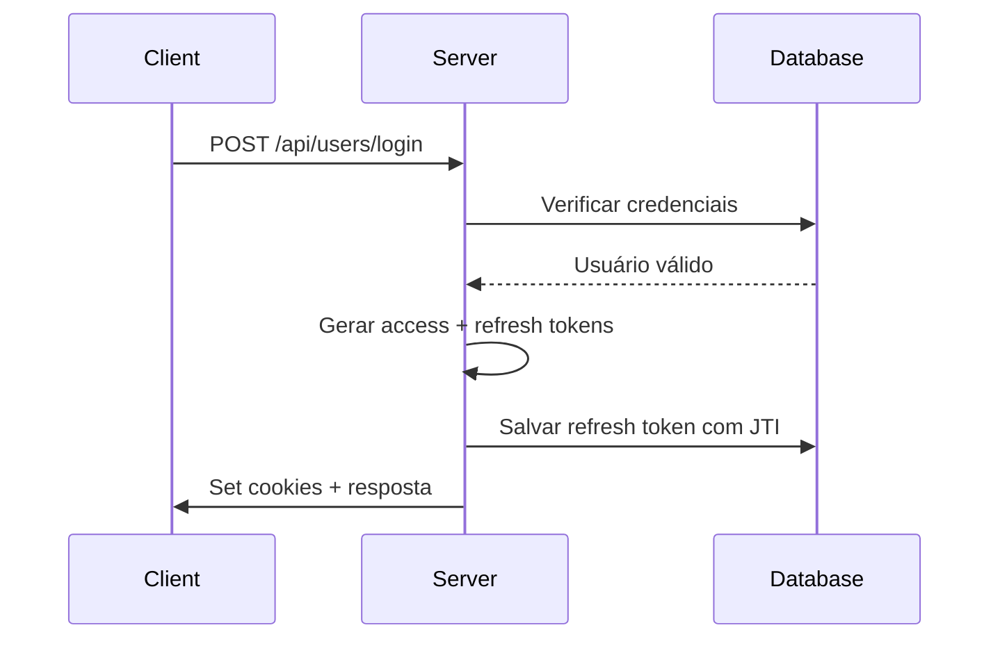
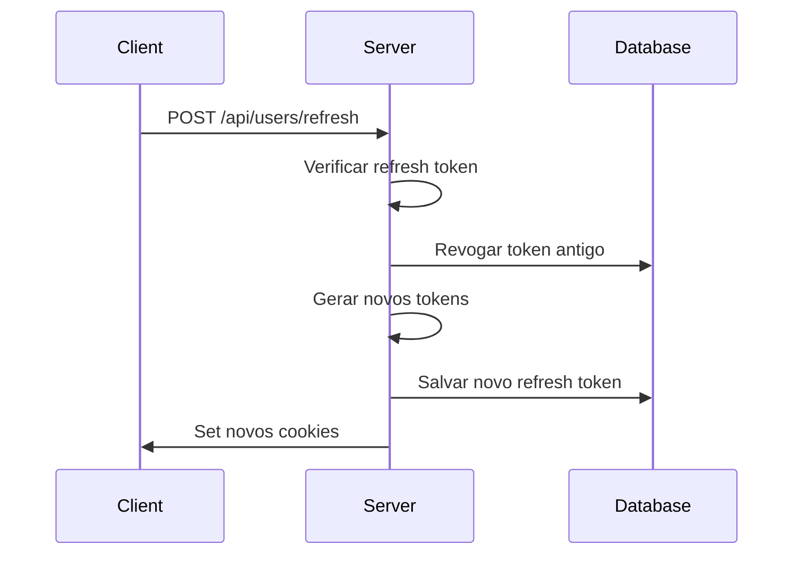
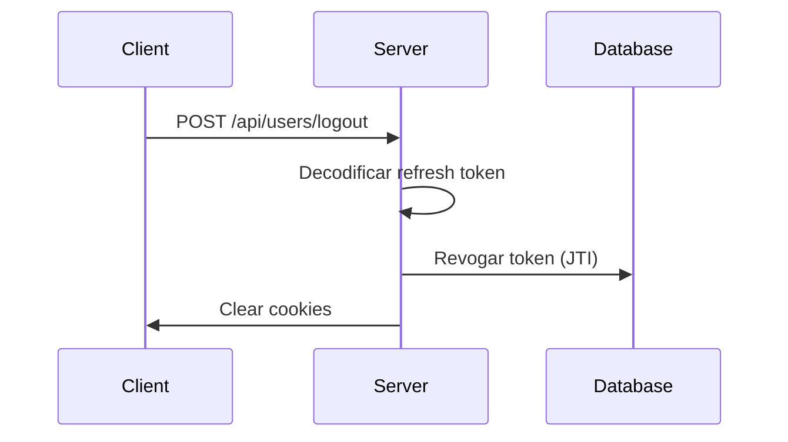

# Sistema de Autenticação Robusto - Fabiana Finanças

## 🚀 Visão Geral

Este sistema implementa uma autenticação "à prova de bala" com:
- **Tokens duais**: Access Token (curto prazo) + Refresh Token (longo prazo)
- **JTI (JWT ID)**: Identificador único para cada refresh token
- **Cookies httpOnly**: Segurança máxima sem exposição no JavaScript
- **Rotação automática**: Refresh tokens são renovados a cada uso
- **Auditoria completa**: Rastreamento de dispositivos, IPs e user agents
- **Middleware modular**: Sistema flexível de permissões e roles
- **Repositório limpo**: Abstração da lógica de banco de dados

## 📁 Estrutura dos Arquivos

### Backend
```
backend/
├── utils/
│   └── tokenManager.js          # Gerenciamento central de tokens
├── models/
│   ├── userModel.js             # Modelo de usuário com sessões
│   └── refreshTokenModel.js     # Modelo de refresh tokens
├── repos/
│   └── refreshRepo.js           # Repositório de refresh tokens
├── middleware/
│   ├── authMiddleware.js        # Middleware de autenticação básica
│   └── adminMiddleware.js       # Middleware de roles e permissões
├── controllers/
│   ├── userController.js        # Controlador de usuários
│   └── adminController.js       # Controlador de administradores
├── routes/
│   ├── userRoutes.js            # Rotas de usuários
│   └── adminRoutes.js           # Rotas de administradores
└── scripts/
    └── cleanupTokens.js         # Limpeza automática de tokens
```

### Frontend
```
frontend/
├── src/
│   ├── app/api/auth/[...nextauth]/
│   │   └── route.ts             # Configuração NextAuth
│   ├── hooks/
│   │   └── useAuth.ts           # Hook de autenticação
│   └── app/
│       ├── login/page.tsx       # Página de login
│       └── dashboard/layout.tsx # Layout do dashboard
```

## 🔧 Configuração

### 1. Variáveis de Ambiente Backend (`.env`)

```bash
# Banco de dados
MONGODB_URI=mongodb://localhost:27017/fabiana-financas

# JWT Secrets
JWT_ACCESS_SECRET=your-super-secret-access-key-here
JWT_REFRESH_SECRET=your-super-secret-refresh-key-here

# TTL dos tokens (em segundos)
ACCESS_TOKEN_TTL=900      # 15 minutos
REFRESH_TOKEN_TTL=1209600 # 14 dias

# Configurações do servidor
NODE_ENV=development
PORT=5000
FRONTEND_URL=http://localhost:3000

# URLs permitidas para CORS
ALLOWED_ORIGINS=http://localhost:3000,https://fabiana-financas-proj.vercel.app
```

### 2. Variáveis de Ambiente Frontend (`.env.local`)

```bash
NEXT_PUBLIC_API_URL=http://localhost:5000
NEXTAUTH_URL=http://localhost:3000
NEXTAUTH_SECRET=your-nextauth-secret-key-here
NODE_ENV=development
```

## 🚀 Instalação e Configuração

### 1. Instalar Dependências

```bash
# Backend
cd backend
npm install cookie-parser cors helmet uuid

# Frontend
cd frontend
npm install
```

### 2. Configurar Banco de Dados

```bash
# Criar arquivo .env no backend
cp env.example .env
# Editar .env com suas configurações
```

### 3. Executar Migrações

```bash
# O sistema criará automaticamente as coleções necessárias
# na primeira execução
```

## 🧪 Testes

### Teste Completo do Sistema

```bash
cd backend
npm run test:complete
```

### Teste de Autenticação Básica

```bash
cd backend
npm run test:auth
```

### Limpeza de Tokens Expirados

```bash
cd backend
npm run cleanup:tokens
```

## 🔐 Funcionalidades de Segurança

### 1. Tokens JWT com JTI

- **Access Token**: 15 minutos de vida, usado para requisições
- **Refresh Token**: 14 dias de vida, usado para renovar access tokens
- **JTI**: Identificador único para cada refresh token
- **Rotação**: Cada refresh gera novos tokens e invalida os antigos

### 2. Cookies Seguros

- **httpOnly**: Não acessível via JavaScript
- **Secure**: Apenas HTTPS em produção
- **SameSite**: Configurado para ambiente (Lax/None)
- **Path**: Cookies específicos para diferentes rotas

### 3. Middleware de Autenticação

```javascript
// Autenticação obrigatória
router.use(requireAuth());

// Verificação de role específico
router.use(requireAdmin());

// Verificação de múltiplos roles
router.use(requireAnyRole(['admin', 'moderator']));

// Verificação de propriedade
router.use(requireOwnershipOrAdmin('userId'));
```

### 4. Auditoria e Monitoramento

- **User Agent**: Dispositivo e navegador
- **IP Address**: Endereço de origem
- **Device ID**: Identificador único do dispositivo
- **Timestamps**: Criação e expiração
- **Revogação**: Rastreamento de tokens revogados

## 📊 Endpoints da API

### Usuários (`/api/users`)

| Método | Rota | Descrição | Acesso |
|--------|------|-----------|---------|
| POST | `/login` | Login de usuário | Público |
| POST | `/register` | Registro de usuário | Público |
| POST | `/refresh` | Renovar tokens | Público |
| GET | `/profile` | Perfil do usuário | Privado |
| PUT | `/profile` | Atualizar perfil | Privado |
| POST | `/logout` | Logout | Privado |
| POST | `/logout-all` | Logout de todas as sessões | Privado |
| GET | `/sessions` | Estatísticas de sessões | Privado |

### Administradores (`/api/admin`)

| Método | Rota | Descrição | Acesso |
|--------|------|-----------|---------|
| POST | `/login` | Login de admin | Público |
| GET | `/me` | Perfil do admin | Admin |
| GET | `/users` | Listar usuários | Admin |
| GET | `/users/:id` | Detalhes do usuário | Admin |
| PUT | `/users/:id` | Atualizar usuário | Admin |
| PATCH | `/users/:id/toggle-status` | Ativar/desativar usuário | Admin |
| POST | `/users/:id/revoke-sessions` | Revogar sessões | Admin |
| GET | `/stats` | Estatísticas do sistema | Admin |

## 🔄 Fluxo de Autenticação

### 1. Login



### 2. Renovação de Token



### 3. Logout



## 🛡️ Middleware de Segurança

### 1. `requireAuth(optional = false)`

- Verifica se o usuário está autenticado
- Opcional: permite acesso sem autenticação se `optional = true`
- Retorna erro 401 se não autenticado

### 2. `requireRole(role)`

- Verifica se o usuário tem o role específico
- Retorna erro 403 se role insuficiente
- Deve ser usado após `requireAuth()`

### 3. `requireAdmin()`

- Verifica se o usuário é admin ou super_admin
- Retorna erro 403 se não for admin
- Deve ser usado após `requireAuth()`

### 4. `requireOwnershipOrAdmin(userIdField)`

- Verifica se o usuário é dono do recurso OU admin
- Útil para recursos que pertencem a usuários específicos
- Deve ser usado após `requireAuth()`

### 5. `logAccess(action)`

- Registra todas as ações de acesso
- Inclui timestamp, usuário, IP, user agent
- Pode ser expandido para salvar no banco

## 🔍 Monitoramento e Debug

### 1. Logs de Acesso

```javascript
// Exemplo de log de acesso
🔐 Access Log: {
  timestamp: '2024-01-15T10:30:00.000Z',
  action: 'get_profile',
  userId: '507f1f77bcf86cd799439011',
  userRole: 'user',
  method: 'GET',
  path: '/api/users/profile',
  ip: '127.0.0.1',
  userAgent: 'Mozilla/5.0...'
}
```

### 2. Estatísticas de Tokens

```javascript
// Exemplo de estatísticas
{
  total: 150,
  valid: 120,
  revoked: 25,
  expired: 5,
  activePercentage: 80
}
```

### 3. Sessões Ativas

- Contador de sessões ativas por usuário
- Rastreamento de dispositivos conectados
- Histórico de login/logout

## 🚨 Tratamento de Erros

### 1. Erros de Autenticação

- **401 Unauthorized**: Token inválido ou expirado
- **403 Forbidden**: Permissões insuficientes
- **409 Conflict**: Conflito (ex: email já cadastrado)

### 2. Erros de Validação

- **400 Bad Request**: Dados inválidos
- **404 Not Found**: Recurso não encontrado
- **500 Internal Server Error**: Erro interno do servidor

### 3. Respostas de Erro Padrão

```javascript
{
  error: 'Descrição do erro',
  code: 'ERROR_CODE',
  details: { /* detalhes adicionais */ }
}
```

## 🔧 Manutenção

### 1. Limpeza Automática

```bash
# Executar limpeza manual
npm run cleanup:tokens

# Configurar cron job para limpeza automática
# 0 2 * * * cd /path/to/backend && npm run cleanup:tokens
```

### 2. Monitoramento de Performance

- Índices no banco para consultas rápidas
- TTL automático para tokens expirados
- Estatísticas em tempo real

### 3. Backup e Recuperação

- Backup regular da coleção de refresh tokens
- Scripts de migração para atualizações
- Logs de auditoria para troubleshooting

## 🚀 Deploy em Produção

### 1. Configurações de Produção

```bash
NODE_ENV=production
FRONTEND_URL=https://seudominio.com
ALLOWED_ORIGINS=https://seudominio.com
```

### 2. Segurança em Produção

- **HTTPS obrigatório**: Cookies Secure = true
- **SameSite = None**: Para cross-origin em produção
- **Trust Proxy**: Configurado para Vercel/Render/Nginx
- **Rate Limiting**: Implementar limitação de requisições

### 3. Monitoramento em Produção

- Logs estruturados (JSON)
- Métricas de performance
- Alertas para falhas de autenticação
- Dashboard de estatísticas

## 📚 Recursos Adicionais

### 1. Documentação

- [JWT.io](https://jwt.io/) - Debugger de tokens JWT
- [NextAuth.js](https://next-auth.js.org/) - Documentação oficial
- [MongoDB](https://docs.mongodb.com/) - Documentação do banco

### 2. Ferramentas de Teste

- [Postman](https://www.postman.com/) - Teste de APIs
- [Insomnia](https://insomnia.rest/) - Cliente REST alternativo
- [JWT Debugger](https://jwt.io/) - Debug de tokens

### 3. Monitoramento

- [Sentry](https://sentry.io/) - Monitoramento de erros
- [LogRocket](https://logrocket.com/) - Replay de sessões
- [DataDog](https://www.datadoghq.com/) - APM e logs

## 🎯 Próximos Passos

### 1. Implementações Futuras

- [ ] Rate limiting por IP/usuário
- [ ] 2FA (Two-Factor Authentication)
- [ ] Login social (Google, Facebook, etc.)
- [ ] Auditoria avançada com Elasticsearch
- [ ] Dashboard de administração

### 2. Melhorias de Performance

- [ ] Cache Redis para tokens
- [ ] Compressão de respostas
- [ ] CDN para assets estáticos
- [ ] Load balancing

### 3. Segurança Avançada

- [ ] Detecção de atividades suspeitas
- [ ] Geolocalização de login
- [ ] Whitelist de IPs para admin
- [ ] Criptografia adicional de dados sensíveis

---

## 🏆 Conclusão

Este sistema de autenticação implementa as melhores práticas de segurança da indústria:

✅ **Segurança**: Tokens JWT com JTI, cookies httpOnly, rotação automática  
✅ **Performance**: Índices otimizados, limpeza automática, cache inteligente  
✅ **Monitoramento**: Auditoria completa, logs estruturados, métricas em tempo real  
✅ **Escalabilidade**: Arquitetura modular, middlewares reutilizáveis, repositórios limpos  
✅ **Manutenibilidade**: Código bem documentado, testes automatizados, scripts de manutenção  

O sistema está pronto para produção e pode ser facilmente expandido para atender às necessidades futuras do projeto Fabiana Finanças. 