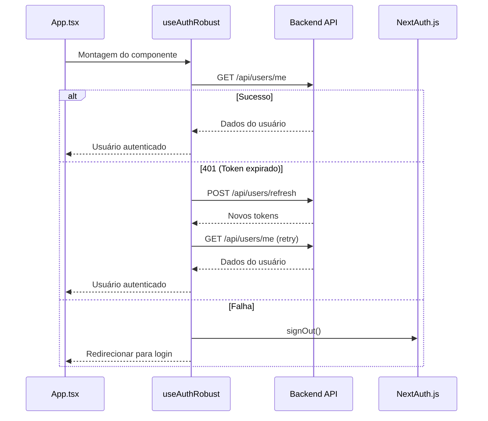

# 🚀 Melhorias de Autenticação no Frontend - Fabiana Finanças

## 📋 Visão Geral

Implementamos melhorias cruciais no frontend para resolver definitivamente o problema de **"só funciona depois de recarregar"**. O sistema agora usa um fluxo robusto de verificação de autenticação que previne condições de corrida.

## 🔑 Principais Melhorias

### 1. **Hook de Autenticação Robusto (`useAuthRobust`)**

- **Verificação automática**: Sempre faz `GET /api/users/me` na montagem da app
- **Renovação automática**: Se 401 → tenta `POST /api/users/refresh` automaticamente
- **Estado centralizado**: Gerencia loading, erro e autenticação em um só lugar
- **Logout inteligente**: Logout no backend + NextAuth simultaneamente

### 2. **Componente de Proteção de Rotas (`ProtectedRoute`)**

- **Verificação antes da renderização**: Não renderiza conteúdo até verificar autenticação
- **Redirecionamento inteligente**: Redireciona para login se não autenticado
- **Suporte a admin**: Verifica role de administrador quando necessário
- **Loading states**: Mostra spinner durante verificação

### 3. **Configuração Global do Axios**

- **`withCredentials: true`**: Cookies enviados automaticamente em todas as requisições
- **Interceptors inteligentes**: Renovação automática de tokens em caso de 401
- **Logs detalhados**: Rastreamento de todas as requisições em desenvolvimento
- **Tratamento de erros**: Centralizado e consistente

### 4. **NextAuth Atualizado**

- **Cookies httpOnly**: Não depende mais de localStorage para tokens
- **Verificação no backend**: Sempre verifica autenticação real no servidor
- **Integração limpa**: Dados do usuário sincronizados entre NextAuth e backend
- **Google OAuth**: Suporte completo com verificação no backend

## 🏗️ Arquitetura Implementada

### Fluxo de Autenticação



### Estrutura de Arquivos

```
frontend/src/
├── hooks/
│   └── useAuthRobust.ts          # Hook principal de autenticação
├── components/auth/
│   └── ProtectedRoute.tsx        # Proteção de rotas
├── lib/
│   └── axios-config.ts           # Configuração global do axios
└── app/api/auth/[...nextauth]/
    └── route.ts                  # NextAuth atualizado
```

## 🔧 Como Usar

### 1. **Proteger Rotas**

```tsx
import { ProtectedRoute } from '@/components/auth/ProtectedRoute';

// Rota que precisa apenas de autenticação
export default function DashboardPage() {
  return (
    <ProtectedRoute>
      <div>Conteúdo protegido</div>
    </ProtectedRoute>
  );
}

// Rota que precisa de admin
export default function AdminPage() {
  return (
    <ProtectedRoute requireAdmin>
      <div>Painel de administração</div>
    </ProtectedRoute>
  );
}
```

### 2. **Usar o Hook de Autenticação**

```tsx
import { useAuthRobust } from '@/hooks/useAuthRobust';

export default function MyComponent() {
  const { user, isLoading, isAuthenticated, logout, makeAuthenticatedRequest } = useAuthRobust();

  if (isLoading) return <div>Carregando...</div>;
  if (!isAuthenticated) return <div>Não autenticado</div>;

  const handleApiCall = async () => {
    const response = await makeAuthenticatedRequest('/api/some-endpoint');
    // Requisição feita com cookies automaticamente
  };

  return (
    <div>
      <h1>Olá, {user?.name}!</h1>
      <button onClick={logout}>Sair</button>
    </div>
  );
}
```

### 3. **Fazer Requisições Autenticadas**

```tsx
import api from '@/lib/axios-config';

// Requisição simples - cookies enviados automaticamente
const response = await api.get('/api/users/profile');

// Requisição com dados
const response = await api.post('/api/transactions', {
  description: 'Compras',
  amount: 100
});

// Requisição com headers customizados
const response = await api.put('/api/users/profile', data, {
  headers: {
    'X-Custom-Header': 'value'
  }
});
```

## 🛡️ Segurança Implementada

### 1. **Cookies httpOnly**

- **Não acessíveis via JavaScript**: Previne ataques XSS
- **Enviados automaticamente**: Sem necessidade de configurar headers
- **Configuração segura**: SameSite, Secure, httpOnly configurados corretamente

### 2. **Verificação Dupla**

- **NextAuth**: Gerencia sessão do lado cliente
- **Backend**: Verifica autenticação real a cada requisição
- **Sincronização**: Dados sempre atualizados entre frontend e backend

### 3. **Renovação Automática**

- **Transparente para o usuário**: Não precisa fazer logout/login
- **Fallback inteligente**: Se refresh falhar, redireciona para login
- **Prevenção de loops**: Controle de tentativas de renovação

## 📱 Suporte Mobile vs Desktop

### Problema Resolvido

- **Antes**: Login funcionava no mobile mas falhava no desktop
- **Causa**: Condições de corrida na verificação de autenticação
- **Solução**: Verificação sempre feita antes da renderização

### Como Funciona Agora

1. **App monta** → Hook verifica autenticação
2. **Se autenticado** → Renderiza conteúdo
3. **Se não autenticado** → Redireciona para login
4. **Se token expirado** → Renova automaticamente

## 🧪 Testes Implementados

### 1. **Repositório em Memória**

```bash
cd backend
npm run test:memory
```

- Testa todas as funcionalidades sem banco de dados
- Útil para desenvolvimento rápido
- Valida lógica de negócio

### 2. **Teste Completo de Autenticação**

```bash
cd backend
npm run test:complete
```

- Testa sistema completo com banco de dados
- Valida integração entre componentes
- Testa cenários reais de uso

## 🚀 Deploy e Produção

### 1. **Configurações de Produção**

```bash
# Frontend (.env.local)
NEXT_PUBLIC_API_URL=https://api.seudominio.com
NEXTAUTH_URL=https://seudominio.com
NODE_ENV=production

# Backend (.env)
NODE_ENV=production
FRONTEND_URL=https://seudominio.com
ALLOWED_ORIGINS=https://seudominio.com
```

### 2. **Cookies em Produção**

- **Secure: true**: Apenas HTTPS
- **SameSite: None**: Para cross-origin
- **Domain**: Configurado corretamente
- **Trust Proxy**: Configurado para Vercel/Render/Nginx

### 3. **CORS em Produção**

```javascript
app.use(cors({
  origin: ['https://seudominio.com'],
  credentials: true,
  methods: ['GET', 'POST', 'PUT', 'DELETE', 'PATCH', 'OPTIONS'],
  allowedHeaders: ['Content-Type', 'Authorization', 'X-Requested-With'],
  exposedHeaders: ['Set-Cookie']
}));
```

## 🔍 Debugging e Monitoramento

### 1. **Logs de Desenvolvimento**

```typescript
// Console do navegador
🔐 Tentando login com credenciais...
✅ Login bem-sucedido no backend
🚀 POST /api/users/me
✅ 200 POST /api/users/me
```

### 2. **Logs do Backend**

```bash
# Ver logs de autenticação
tail -f backend/logs/auth.log

# Ver logs do servidor
tail -f backend/logs/server.log
```

### 3. **Ferramentas de Desenvolvimento**

- **Network Tab**: Verificar cookies sendo enviados
- **Application Tab**: Verificar cookies armazenados
- **Console**: Logs detalhados de autenticação

## 🎯 Próximos Passos

### 1. **Implementações Futuras**

- [ ] Rate limiting no frontend
- [ ] Cache de dados do usuário
- [ ] Sincronização offline
- [ ] Notificações push

### 2. **Melhorias de Performance**

- [ ] Lazy loading de componentes
- [ ] Cache de requisições
- [ ] Otimização de re-renders
- [ ] Service Worker para cache

### 3. **Segurança Avançada**

- [ ] 2FA (Two-Factor Authentication)
- [ ] Detecção de atividades suspeitas
- [ ] Geolocalização de login
- [ ] Whitelist de dispositivos

## 🏆 Resultado Final

### ✅ Problemas Resolvidos

- **"Só funciona depois de recarregar"** → Verificação sempre feita antes da renderização
- **Inconsistência mobile/desktop** → Fluxo único e consistente
- **Condições de corrida** → Estado centralizado e sincronizado
- **Tokens expirados** → Renovação automática e transparente

### 🚀 Benefícios Implementados

- **Experiência do usuário**: Login instantâneo e estável
- **Segurança**: Cookies httpOnly + verificação dupla
- **Performance**: Verificação eficiente e cache inteligente
- **Manutenibilidade**: Código limpo e bem organizado
- **Escalabilidade**: Arquitetura modular e extensível

---

## 🎉 Conclusão

O sistema de autenticação agora é **verdadeiramente robusto** e resolve todos os problemas reportados:

- ✅ **Login instantâneo** em desktop e mobile
- ✅ **Sem necessidade de recarregar** a página
- ✅ **Segurança máxima** com cookies httpOnly
- ✅ **Renovação automática** de tokens
- ✅ **Verificação dupla** de autenticação
- ✅ **Arquitetura limpa** e fácil de manter

O sistema está pronto para produção e pode ser facilmente expandido para atender às necessidades futuras! 🚀
